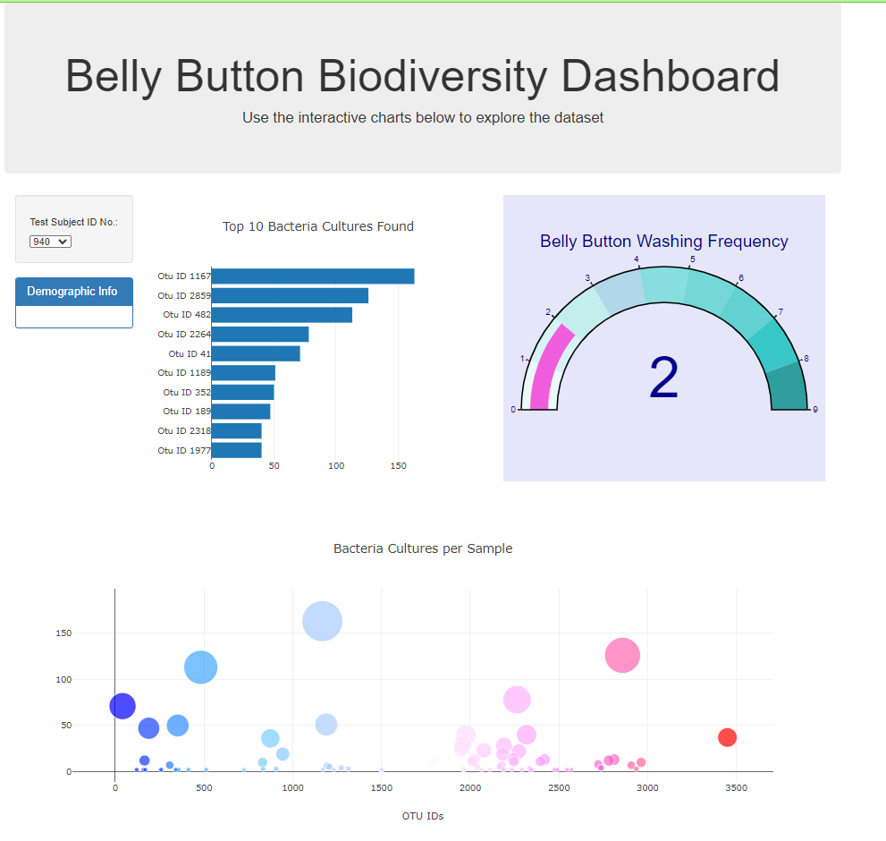

# Plot.ly-Challenge-Homework
## Belly-Button Biodiversity

### Technologies Used
* Javascript  
* Plot.ly  
* HTML  
* D3  
* JSON  

## Project
* Created a dropdown menu to pull in data by Personal ID that populates a table that contains demographic data.  
* The Personal ID will also be used to pull data to create a bar graph of the top ten most populous bacteria found in that person's belly button.  
* The Personal ID is also used to create a Bubble Chart of all of the bacteria showing the amounts of each type.  
* Lastly, the Personal ID is used to create a Gauge of how many times per week the person washes their belly button.
